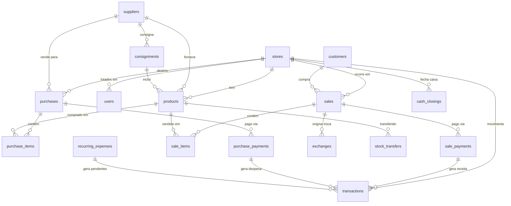

# Fernanda Vinícius — Schema do Banco de Dados

> **Schema Supabase:** `fv`  
> **Convenções:** snake_case, tabelas no plural, UUIDs como PK, numeric(12,2) para valores monetários, timestamptz para timestamps

---

## Visão Geral das Tabelas



---

## 1. Core — Lojas, Usuários, Configurações

### `stores` (lojas)

| Coluna | Tipo | Constraints | Descrição |
|--------|------|-------------|-----------|
| id | uuid | PK, default gen_random_uuid() | |
| name | text | NOT NULL | Nome da loja |
| city | text | NOT NULL | Cidade |
| state | varchar(2) | NOT NULL | UF |
| address | text | | Endereço completo |
| phone | text | | Telefone da loja |
| cnpj | varchar(18) | UNIQUE | CNPJ formatado |
| is_active | boolean | NOT NULL, default true | Ativa/desativada |
| created_at | timestamptz | NOT NULL, default now() | |
| updated_at | timestamptz | NOT NULL, default now() | |

### `users` (usuários do sistema)

> Estende Supabase Auth. Cada registro referencia `auth.users.id`.

| Coluna | Tipo | Constraints | Descrição |
|--------|------|-------------|-----------|
| id | uuid | PK, references auth.users(id) | Mesmo ID do Auth |
| full_name | text | NOT NULL | Nome completo |
| role | text | NOT NULL, check in ('admin','operator') | Perfil de acesso |
| store_id | uuid | FK → stores(id) | Loja do operador (NULL para admin que vê tudo) |
| is_active | boolean | NOT NULL, default true | |
| created_at | timestamptz | NOT NULL, default now() | |
| updated_at | timestamptz | NOT NULL, default now() | |

### `settings` (configurações do sistema)

| Coluna | Tipo | Constraints | Descrição |
|--------|------|-------------|-----------|
| id | uuid | PK, default gen_random_uuid() | |
| key | text | NOT NULL, UNIQUE | Chave da config |
| value | jsonb | NOT NULL | Valor (flexível) |
| description | text | | Descrição legível |
| created_at | timestamptz | NOT NULL, default now() | |
| updated_at | timestamptz | NOT NULL, default now() | |

**Seeds iniciais de settings:**

```json
{ "key": "pix_discount_pct", "value": 5, "description": "Desconto % no Pix" }
{ "key": "birthday_discount_pct", "value": 10, "description": "Desconto % mês aniversário" }
{ "key": "max_installments_default", "value": 5, "description": "Parcelas s/ juros padrão" }
{ "key": "max_installments_above_3k", "value": 6, "description": "Parcelas s/ juros acima de R$3k" }
{ "key": "installment_threshold", "value": 3000, "description": "Valor para parcelas extras" }
{ "key": "exchange_deadline_days", "value": 30, "description": "Prazo de troca em dias" }
{ "key": "default_markup_pct", "value": 100, "description": "Markup % padrão sobre custo para sugestão de preço de venda" }
```

---

## 2. Catálogo — Fornecedores, Produtos

### `suppliers` (fornecedores)

| Coluna | Tipo | Constraints | Descrição |
|--------|------|-------------|-----------|
| id | uuid | PK, default gen_random_uuid() | |
| name | text | NOT NULL | Nome completo |
| initials | varchar(5) | NOT NULL | Iniciais para código (ex: "MJ") |
| phone | text | | Telefone |
| email | text | | E-mail |
| city | text | | Cidade |
| notes | text | | Observações gerais |
| is_active | boolean | NOT NULL, default true | |
| created_at | timestamptz | NOT NULL, default now() | |
| updated_at | timestamptz | NOT NULL, default now() | |

### `products` (produtos = catálogo + estoque)

> Cada linha = um produto (ou lote de peças idênticas) **em uma loja específica**.
> O preço de custo é visível apenas para usuários com role = 'admin'.
> `category` e `material` são **texto livre com normalização** (`LOWER(TRIM())`) — o front exibe autocomplete baseado em `SELECT DISTINCT` dos valores existentes.

| Coluna | Tipo | Constraints | Descrição |
|--------|------|-------------|-----------|
| id | uuid | PK, default gen_random_uuid() | |
| code | text | NOT NULL | Código da etiqueta (F+iniciais+mês+custo) |
| name | text | NOT NULL | Descrição do produto |
| category | text | NOT NULL | Categoria (texto livre: colar, anel, brinco, etc.) |
| material | text | NOT NULL | Material (texto livre: prata, banhado, etc.) |
| supplier_id | uuid | NOT NULL, FK → suppliers(id) | Fornecedor de origem |
| store_id | uuid | NOT NULL, FK → stores(id) | Loja onde está |
| cost_price | numeric(12,2) | NOT NULL | Preço de custo (oculto para operadoras) |
| sale_price | numeric(12,2) | NOT NULL | Preço de venda |
| promotional_price | numeric(12,2) | | Preço promocional (NULL = sem promoção) |
| quantity_in_stock | integer | NOT NULL, default 1 | Quantidade em estoque |
| ownership_type | text | NOT NULL, default 'own', check in ('own','consignment') | Próprio ou consignado |
| consignment_id | uuid | FK → consignments(id) | Lote de consignação (se aplicável) |
| purchase_id | uuid | FK → purchases(id) | Compra que originou este produto |
| purchase_month | smallint | NOT NULL | Mês da compra (para código) |
| purchase_year | smallint | NOT NULL | Ano da compra |
| last_sale_date | timestamptz | | Data da última venda (atualizado automaticamente) |
| photo_url | text | | URL da foto no MinIO |
| is_active | boolean | NOT NULL, default true | |
| created_at | timestamptz | NOT NULL, default now() | |
| updated_at | timestamptz | NOT NULL, default now() | |

**Índices:**
- `idx_products_store` em (store_id, is_active)
- `idx_products_category` em (category)
- `idx_products_material` em (material)
- `idx_products_supplier` em (supplier_id)
- `idx_products_code` em (code)
- `idx_products_ownership` em (ownership_type) WHERE ownership_type = 'consignment'

---

## 3. Compras — Pedidos, Itens, Parcelas, Consignações

### `purchases` (compras / pedidos de compra)

| Coluna | Tipo | Constraints | Descrição |
|--------|------|-------------|-----------|
| id | uuid | PK, default gen_random_uuid() | |
| supplier_id | uuid | NOT NULL, FK → suppliers(id) | Fornecedor |
| store_id | uuid | NOT NULL, FK → stores(id) | Loja destino |
| user_id | uuid | NOT NULL, FK → users(id) | Quem registrou |
| purchase_date | date | NOT NULL | Data da compra |
| total_cost | numeric(12,2) | NOT NULL | Valor total da compra |
| total_items | integer | NOT NULL | Quantidade de itens |
| payment_summary | text | | Resumo gerado: "À vista R$5.000" ou "3x R$1.666" (auto) |
| nf_number | text | | Número da NF-e |
| nf_url | text | | URL da NF no MinIO |
| notes | text | | Observações |
| created_at | timestamptz | NOT NULL, default now() | |
| updated_at | timestamptz | NOT NULL, default now() | |

### `purchase_items` (itens de uma compra)

| Coluna | Tipo | Constraints | Descrição |
|--------|------|-------------|-----------|
| id | uuid | PK, default gen_random_uuid() | |
| purchase_id | uuid | NOT NULL, FK → purchases(id) ON DELETE CASCADE | |
| product_id | uuid | NOT NULL, FK → products(id) | Produto criado |
| quantity | integer | NOT NULL | Quantidade |
| unit_cost | numeric(12,2) | NOT NULL | Custo unitário |
| subtotal | numeric(12,2) | NOT NULL | quantity × unit_cost |
| created_at | timestamptz | NOT NULL, default now() | |

### `purchase_payments` (formas de pagamento da compra)

> Mesma lógica de `sale_payments`. Cada linha = um pagamento (ou parcela) da compra.
> Compra à vista = 1 linha com `status='completed'`. Compra parcelada em 5x = 5 linhas com `status='pending'` e `due_date` escalonadas.
> Cada `purchase_payment` gera automaticamente uma `transaction` do tipo `expense`.

| Coluna | Tipo | Constraints | Descrição |
|--------|------|-------------|-----------|
| id | uuid | PK, default gen_random_uuid() | |
| purchase_id | uuid | NOT NULL, FK → purchases(id) ON DELETE CASCADE | |
| payment_method | text | NOT NULL, check in ('cash','pix','transfer','credit') | Método de pagamento |
| amount | numeric(12,2) | NOT NULL | Valor desta parcela/pagamento |
| installment_number | smallint | | Nº da parcela (1, 2, 3... NULL para à vista) |
| due_date | date | | Vencimento (NULL para pagamentos à vista) |
| status | text | NOT NULL, default 'completed', check in ('completed','pending') | |
| paid_at | timestamptz | | Data do pagamento efetivo |
| created_at | timestamptz | NOT NULL, default now() | |

**Índice:** `idx_purchase_payments_status` em (status, due_date) WHERE status = 'pending'

### `consignments` (lotes de consignação)

| Coluna | Tipo | Constraints | Descrição |
|--------|------|-------------|-----------|
| id | uuid | PK, default gen_random_uuid() | |
| supplier_id | uuid | NOT NULL, FK → suppliers(id) | Fornecedor |
| store_id | uuid | NOT NULL, FK → stores(id) | Loja destino |
| user_id | uuid | NOT NULL, FK → users(id) | Quem registrou |
| received_date | date | NOT NULL | Data de recebimento |
| return_deadline | date | NOT NULL | Prazo para devolução/pagamento |
| min_purchase_pct | numeric(5,2) | | % mínimo de compra do lote |
| total_pieces | integer | NOT NULL | Total de peças recebidas |
| total_cost_value | numeric(12,2) | NOT NULL | Valor de custo total do lote (conforme acordado com fornecedor) |
| status | text | NOT NULL, default 'active', check in ('active','settled','returned') | |
| settled_at | timestamptz | | Data de acerto |
| notes | text | | |
| created_at | timestamptz | NOT NULL, default now() | |
| updated_at | timestamptz | NOT NULL, default now() | |

---

## 4. Vendas — Clientes, Vendas, Itens, Trocas

### `customers` (clientes)

| Coluna | Tipo | Constraints | Descrição |
|--------|------|-------------|-----------|
| id | uuid | PK, default gen_random_uuid() | |
| name | text | NOT NULL | Nome completo |
| phone | text | NOT NULL | Telefone (principal) |
| cpf | varchar(14) | UNIQUE | CPF formatado (nullable) |
| email | text | | E-mail |
| birthday | date | | Data de aniversário |
| address | text | | Endereço |
| city | text | | Cidade |
| state | varchar(2) | | UF |
| zip_code | varchar(9) | | CEP |
| origin_store_id | uuid | NOT NULL, FK → stores(id) | Loja onde foi cadastrado (informativo — pode comprar em qualquer loja) |
| notes | text | | Observações |
| created_at | timestamptz | NOT NULL, default now() | |
| updated_at | timestamptz | NOT NULL, default now() | |

**Índices:**
- `idx_customers_phone` em (phone)
- `idx_customers_birthday` em (EXTRACT(MONTH FROM birthday))
- `idx_customers_origin_store` em (origin_store_id)

### `sales` (vendas)

| Coluna | Tipo | Constraints | Descrição |
|--------|------|-------------|-----------|
| id | uuid | PK, default gen_random_uuid() | |
| store_id | uuid | NOT NULL, FK → stores(id) | Loja |
| customer_id | uuid | FK → customers(id) | Cliente (nullable para venda rápida) |
| user_id | uuid | NOT NULL, FK → users(id) | Vendedora |
| sale_date | timestamptz | NOT NULL, default now() | Data/hora da venda |
| subtotal | numeric(12,2) | NOT NULL | Soma antes de desconto |
| discount_type | text | check in ('pix','birthday','promotion','manual',null) | Tipo de desconto |
| discount_pct | numeric(5,2) | default 0 | % de desconto aplicado |
| discount_amount | numeric(12,2) | NOT NULL, default 0 | Valor do desconto em R$ |
| total | numeric(12,2) | NOT NULL | Valor final cobrado |
| total_cost | numeric(12,2) | NOT NULL | Custo total dos itens (para margem) |
| payment_summary | text | | Resumo gerado: "Pix R$200 + Crédito 3x R$300" (auto) |
| status | text | NOT NULL, default 'completed', check in ('completed','exchanged','cancelled') | |
| notes | text | | |
| created_at | timestamptz | NOT NULL, default now() | |
| updated_at | timestamptz | NOT NULL, default now() | |

**Índices:**
- `idx_sales_store_date` em (store_id, sale_date)
- `idx_sales_customer` em (customer_id)

### `sale_items` (itens de venda)

| Coluna | Tipo | Constraints | Descrição |
|--------|------|-------------|-----------|
| id | uuid | PK, default gen_random_uuid() | |
| sale_id | uuid | NOT NULL, FK → sales(id) ON DELETE CASCADE | |
| product_id | uuid | NOT NULL, FK → products(id) | Produto vendido |
| quantity | integer | NOT NULL | Quantidade |
| unit_price | numeric(12,2) | NOT NULL | Preço de venda no momento |
| unit_cost | numeric(12,2) | NOT NULL | Custo no momento (para snapshot de margem) |
| subtotal | numeric(12,2) | NOT NULL | quantity × unit_price |
| created_at | timestamptz | NOT NULL, default now() | |

### `sale_payments` (formas de pagamento da venda)

> Cada linha = um método de pagamento usado na venda. Venda simples (só Pix) = 1 linha. Venda mista (Pix + Crédito) = 2 linhas.
> Cada `sale_payment` gera automaticamente uma `transaction` do tipo `income`.

| Coluna | Tipo | Constraints | Descrição |
|--------|------|-------------|-----------|
| id | uuid | PK, default gen_random_uuid() | |
| sale_id | uuid | NOT NULL, FK → sales(id) ON DELETE CASCADE | |
| payment_method | text | NOT NULL, check in ('credit','debit','pix','cash') | Método de pagamento |
| amount | numeric(12,2) | NOT NULL | Valor pago neste método |
| installments | smallint | NOT NULL, default 1 | Parcelas (relevante para crédito) |
| created_at | timestamptz | NOT NULL, default now() | |

### `exchanges` (trocas)

| Coluna | Tipo | Constraints | Descrição |
|--------|------|-------------|-----------|
| id | uuid | PK, default gen_random_uuid() | |
| original_sale_id | uuid | FK → sales(id) | Venda original (nullable para trocas de vendas pré-sistema) |
| store_id | uuid | NOT NULL, FK → stores(id) | Loja |
| customer_id | uuid | NOT NULL, FK → customers(id) | Cliente |
| user_id | uuid | NOT NULL, FK → users(id) | Quem processou |
| exchange_date | timestamptz | NOT NULL, default now() | |
| reason | text | | Motivo da troca |
| price_difference | numeric(12,2) | NOT NULL, default 0 | Positivo = cliente paga mais |
| payment_method | text | check in ('credit','debit','pix','cash',null) | Se houve diferença |
| notes | text | | |
| created_at | timestamptz | NOT NULL, default now() | |

### `exchange_items` (itens da troca)

| Coluna | Tipo | Constraints | Descrição |
|--------|------|-------------|-----------|
| id | uuid | PK, default gen_random_uuid() | |
| exchange_id | uuid | NOT NULL, FK → exchanges(id) ON DELETE CASCADE | |
| direction | text | NOT NULL, check in ('returned','given') | Devolvido ou entregue |
| product_id | uuid | NOT NULL, FK → products(id) | Produto |
| quantity | integer | NOT NULL | Quantidade |
| unit_price | numeric(12,2) | NOT NULL | Preço de referência |
| created_at | timestamptz | NOT NULL, default now() | |

---

## 5. Financeiro — Transações, Caixa

### `transactions` (ledger financeiro unificado)

> Toda movimentação financeira vira uma linha aqui. Vendas e pagamentos de compra criam transações **automaticamente**. Custos operacionais (aluguel, salário, etc.) são registrados **manualmente**.

| Coluna | Tipo | Constraints | Descrição |
|--------|------|-------------|-----------|
| id | uuid | PK, default gen_random_uuid() | |
| store_id | uuid | FK → stores(id) | Loja (NULL = geral/empresa) |
| type | text | NOT NULL, check in ('income','expense') | Entrada ou saída |
| amount | numeric(12,2) | NOT NULL | Valor (sempre positivo) |
| category | text | NOT NULL | Categoria livre (venda, compra_fornecedor, aluguel, salario, energia, etc.) |
| description | text | NOT NULL | Descrição legível |
| reference_type | text | check in ('sale','purchase','exchange','manual') | Origem da transação |
| reference_id | uuid | | ID da venda/compra/troca que originou (nullable) |
| user_id | uuid | FK → users(id) | Quem registrou (nullable para automáticas) |
| payment_method | text | check in ('credit','debit','pix','transfer','cash') | Forma de pagamento |
| transaction_date | date | NOT NULL | Data da movimentação |
| due_date | date | | Vencimento (para contas a pagar/receber) |
| status | text | NOT NULL, default 'completed', check in ('completed','pending') | Pago ou pendente |
| paid_at | timestamptz | | Data/hora do pagamento efetivo |
| cost_type | text | check in ('fixed','variable') | Apenas para expenses manuais |
| recurring_expense_id | uuid | FK → recurring_expenses(id) | Template que gerou esta transação (nullable) |
| notes | text | | |
| created_at | timestamptz | NOT NULL, default now() | |

**Índices:**
- `idx_transactions_store_date` em (store_id, transaction_date)
- `idx_transactions_type` em (type, transaction_date)
- `idx_transactions_category` em (category)
- `idx_transactions_status` em (status, due_date) WHERE status = 'pending'
- `idx_transactions_ref` em (reference_type, reference_id) WHERE reference_id IS NOT NULL

**Regras de status por origem:**

| Origem | status | paid_at | Lógica |
|--------|--------|---------|--------|
| Venda finalizada | `completed` | now() | Dinheiro já entrou (Cielo processou) |
| Entrada de estoque (à vista) | `completed` | now() | Pagou na hora |
| Parcela de compra (futura) | `pending` | NULL | Será paga no vencimento |
| Despesa fixa (gerada do template) | `pending` | NULL | Fernanda marca como paga quando pagar |
| Despesa avulsa (manual, já paga) | `completed` | now() | Registrou porque já pagou |
| Despesa avulsa (manual, a pagar) | `pending` | NULL | Conta a pagar futura |

**Exemplos concretos:**

| Evento | type | category | status | reference_type |
|--------|------|----------|--------|----------------|
| Venda finalizada | income | venda | completed | sale |
| Parcela 2/5 vence dia 15 | expense | compra_fornecedor | pending | purchase |
| Parcela 2/5 foi paga | expense | compra_fornecedor | completed | purchase |
| Aluguel Mai/2026 (gerado) | expense | aluguel | pending | manual |
| Aluguel Mai/2026 (pago) | expense | aluguel | completed | manual |
| Conta de luz avulsa | expense | energia | completed | manual |

### `cash_closings` (fechamento de caixa)

| Coluna | Tipo | Constraints | Descrição |
|--------|------|-------------|-----------|
| id | uuid | PK, default gen_random_uuid() | |
| store_id | uuid | NOT NULL, FK → stores(id) | Loja |
| user_id | uuid | NOT NULL, FK → users(id) | Quem fechou |
| closing_date | date | NOT NULL | Data do fechamento |
| total_credit | numeric(12,2) | NOT NULL, default 0 | Total em crédito |
| total_debit | numeric(12,2) | NOT NULL, default 0 | Total em débito |
| total_pix | numeric(12,2) | NOT NULL, default 0 | Total em Pix |
| total_cash | numeric(12,2) | NOT NULL, default 0 | Total em dinheiro |
| total_sales | numeric(12,2) | NOT NULL | Total geral |
| sales_count | integer | NOT NULL | Nº de vendas |
| notes | text | | Observações do dia |
| created_at | timestamptz | NOT NULL, default now() | |

**Constraint:** UNIQUE(store_id, closing_date) — um fechamento por loja por dia.

### `recurring_expenses` (templates de despesas recorrentes)

> Define despesas fixas que se repetem. O sistema gera automaticamente uma transação `pending` para cada mês.
> Exemplo: "Aluguel Campinas — R$3.000/mês" gera uma transação pendente no início de cada mês.

| Coluna | Tipo | Constraints | Descrição |
|--------|------|-------------|----------|
| id | uuid | PK, default gen_random_uuid() | |
| store_id | uuid | FK → stores(id) | Loja (NULL = geral/empresa) |
| description | text | NOT NULL | Descrição (ex: "Aluguel Campinas") |
| amount | numeric(12,2) | NOT NULL | Valor mensal |
| category | text | NOT NULL | Categoria (aluguel, salario, energia, etc.) |
| cost_type | text | NOT NULL, default 'fixed', check in ('fixed','variable') | Fixo ou variável |
| recurrence | text | NOT NULL, default 'monthly', check in ('monthly','weekly','annual') | Periodicidade |
| day_of_month | smallint | | Dia do vencimento (1-31, para mensais) |
| is_active | boolean | NOT NULL, default true | Ativa/desativada |
| created_at | timestamptz | NOT NULL, default now() | |
| updated_at | timestamptz | NOT NULL, default now() | |

**Fluxo:**
1. Fernanda cadastra "Aluguel Campinas, R$3.000, fixo, mensal, vence dia 10"
2. Todo mês, o sistema cria automaticamente uma transação: `type='expense', category='aluguel', status='pending', due_date='2026-06-10'`
3. Quando Fernanda paga, ela marca como paga → `status='completed', paid_at=now()`
4. Se o valor mudar em um mês específico (variável), ela edita só aquela transação

---

## 6. Operacional — Transferências de Estoque

### `stock_transfers` (transferências entre lojas)

| Coluna | Tipo | Constraints | Descrição |
|--------|------|-------------|-----------|
| id | uuid | PK, default gen_random_uuid() | |
| product_id | uuid | NOT NULL, FK → products(id) | Produto transferido |
| from_store_id | uuid | NOT NULL, FK → stores(id) | Origem |
| to_store_id | uuid | NOT NULL, FK → stores(id) | Destino |
| quantity | integer | NOT NULL | Quantidade transferida |
| user_id | uuid | NOT NULL, FK → users(id) | Quem fez |
| transfer_date | timestamptz | NOT NULL, default now() | |
| notes | text | | |
| created_at | timestamptz | NOT NULL, default now() | |

---

## 7. Resumo — Todas as Tabelas

| # | Tabela | Registros estimados | Módulo |
|---|--------|--------------------:|--------|
| 1 | stores | 2-5 | Core |
| 2 | users | 3-10 | Core |
| 3 | settings | ~10 | Core |
| 4 | suppliers | 20-50 | Compras |
| 5 | products | Milhares (cresce rápido) | Produtos |
| 6 | purchases | Centenas/ano | Compras |
| 7 | purchase_items | Milhares/ano | Compras |
| 8 | purchase_payments | Centenas/ano | Compras/Financeiro |
| 9 | consignments | Dezenas/ano | Compras |
| 10 | customers | Centenas → milhares | Clientes |
| 11 | sales | Centenas/mês | Vendas |
| 12 | sale_items | Milhares/mês | Vendas |
| 13 | sale_payments | Centenas/mês | Vendas/Financeiro |
| 14 | exchanges | Poucas/mês | Vendas |
| 15 | exchange_items | Poucas/mês | Vendas |
| 16 | transactions | Centenas/mês | Financeiro |
| 17 | recurring_expenses | 5-20 (templates) | Financeiro |
| 18 | cash_closings | 1-2/dia | Financeiro |
| 19 | stock_transfers | Poucas/mês | Produtos |

**Total: 19 tabelas**

---

## 8. RLS (Row Level Security) — Estratégia

| Perfil | Acesso |
|--------|--------|
| **Admin** | Todas as tabelas, todas as lojas, incluindo cost_price e transactions |
| **Operator** | Limitado à sua store_id. Sem acesso a: cost_price em products, total_cost em sales, transactions (expenses manuais), settings |

**Implementação:**
- Policies baseadas em `auth.uid()` → busca role em `users`
- Admin: sem filtro de store
- Operator: `WHERE store_id = (SELECT store_id FROM users WHERE id = auth.uid())`
- Campos sensíveis (custo): controlados via views ou policies de coluna

---

## 9. Views Úteis (sugestão)

| View | Descrição | Usado em |
|------|-----------|----------|
| `v_products_stock` | Produtos com estoque > 0, join com supplier | Módulo Produtos |
| `v_stale_products` | Produtos sem venda há X dias | Dashboard, Produtos |
| `v_daily_sales_summary` | Vendas agregadas por dia/loja/método | Dashboard, Financeiro |
| `v_monthly_pnl` | SUM income - SUM expense da tabela transactions por mês | Financeiro |
| `v_purchase_budget` | Saldo disponível para próxima compra (baseado em transactions) | Dashboard, Financeiro |
| `v_birthday_customers` | Clientes com aniversário no mês atual | Clientes, Vendas |
| `v_inactive_customers` | Clientes sem compra há X dias | Clientes |
| `v_pending_transactions` | Transações pendentes (parcelas + despesas) a vencer nos próximos 30 dias | Financeiro |
| `v_consignment_status` | Consignações ativas com prazo e peças vendidas/restantes | Produtos, Compras |
| `v_distinct_categories` | SELECT DISTINCT category FROM products (para autocomplete) | Produtos |
| `v_distinct_materials` | SELECT DISTINCT material FROM products (para autocomplete) | Produtos |

---

## 10. Decisões de Design

| Decisão | Raciocínio |
|---------|-----------|
| **Produto = linha por loja** | Se a mesma peça existe em 2 lojas, são 2 registros. Simplifica queries de estoque por loja |
| **code não é UNIQUE** | Peças idênticas em lojas diferentes compartilham o mesmo código |
| **category/material como texto** | Sem tabelas dedicadas. Autocomplete via `SELECT DISTINCT` + normalização `LOWER(TRIM())` no backend. Menos tabelas, menos CRUDs, mesma funcionalidade |
| **cost_price no product** | Snapshot do custo no momento da compra. Permite cálculo de margem mesmo se fornecedor mudar preço |
| **unit_cost no sale_items** | Snapshot do custo no momento da venda. Garante precisão histórica da margem |
| **settings como key-value** | Flexível para adicionar configs sem alterar schema |
| **transactions como ledger** | Toda movimentação financeira em uma tabela com `status` (completed/pending). Geradas automaticamente a partir de `sale_payments` e `purchase_payments`. Despesas manuais entram direto. Elimina UNION ALL no financeiro |
| **sale_payments / purchase_payments** | Pagamentos explícitos por método. Suporta pagamentos mistos nativamente (Pix + Crédito na mesma venda). Cada payment gera sua própria transaction |
| **recurring_expenses como templates** | Despesas fixas cadastradas uma vez, geram transações pendentes automaticamente a cada mês. Evita retrabalho manual e garante que nenhuma conta seja esquecida |
| **origin_store_id no customer** | Cliente pertence à empresa, não à loja. O campo indica apenas onde foi cadastrado. Pode comprar em qualquer loja |
| **reference_id aponta para sale/purchase** | O `reference_id` em transactions aponta para a venda ou compra, não para o payment individual. Motivo: no front, a navegação natural é "ver a venda", não "ver o pagamento" |
| **Sem tabela de promoções** | Scope 1: promotional_price direto no produto. Engine de promoções pode vir no Scope 2 |
| **Sem integração Cielo** | Parcelas do cliente via Cielo não são rastreadas (Cielo faz isso). Só registramos o nº de parcelas |
